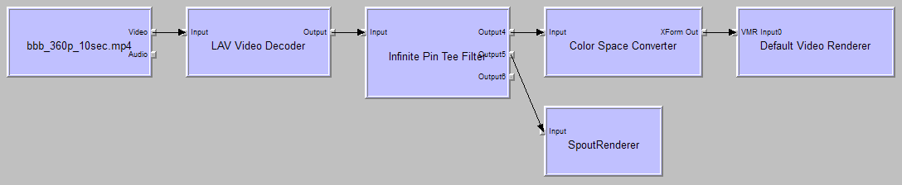

# SpoutRenderer
A simple DirectShow video renderer that renders to an OpenGL texture shared via [Spout](http://spout.zeal.co/).

Spout2 repository:
https://github.com/leadedge/Spout2

*Screenshots*

SpoutRenderer in GraphStudio, playing a 360p H.264 MP4 video:

GraphStudio rendering a 360p H.264 MP4 video both with VMR-7 and SpoutRenderer:

